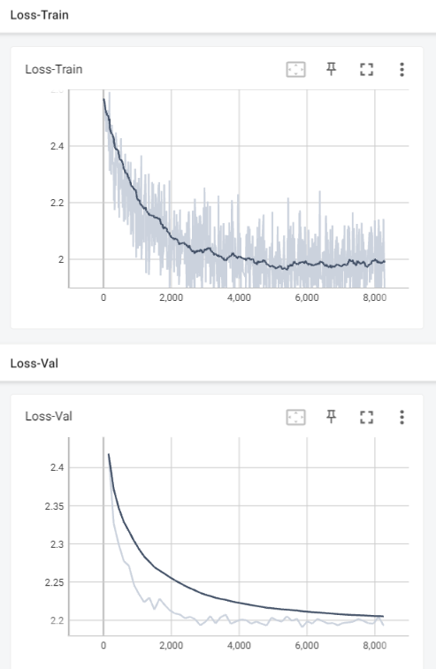
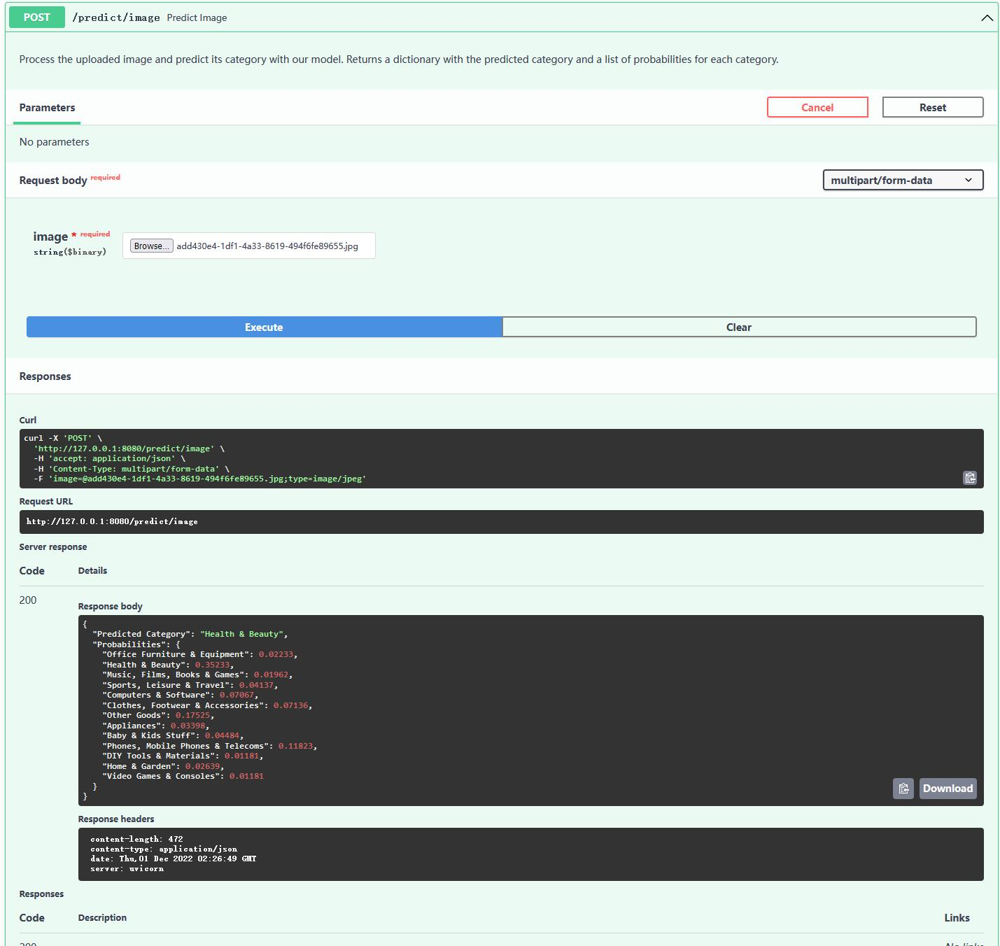

# FacebookPro_AICore
This project is a python recreation of the system behind Facebook marketplace, which uses AI to recommend the most relevant listings based on a personalised search query.

This project requires [Pillow](https://github.com/python-pillow/Pillow), [Sklearn](https://github.com/scikit-learn/scikit-learn), [Pytorch](https://github.com/pytorch/pytorch.github.io), [Tensorboard](https://github.com/tensorflow/tensorboard) and [FastAPI](https://github.com/tiangolo/fastapi).

Note that due to hardware limitations, the aim of this project is to practice Pytorch and API deployment rather than producing an accurate AI prediction model.

## Preliminary processing of the dataset

I downloaded the text and image dataset in .csv and .jpg format respectively. Then I performed some preliminary cleaning of the dataset.

To clean the tabular dataset I converted the prices of the products to np.float64 objects by removing the pound signs and the commas. To clean the image dataset, I made use of the Pillow library to resize all images to 128x128(px) size and standardized them to RGB mode.

## Create a vision model

### Create an image dataset

Firstly I created a dataset that feeds entries to the model. In `image_dataset.py` I defined a class which inherits from `torch.utils.data.Dataset`, which reads all the images and matches them to their corresponding product ids and categories. Note that we must define `__len__` and `__getitem__` methods. The `__getitem__` method finds and loads an image, and then return the image as a torch tensor together with its label.

Additionally, I added image transformations to the dataset. Each image may be horizontally flipped or slightly distorted by a certain probability. This will artifically generate more datapoints for the model to learn and hopefully improve its performance against test datasets with new, unfamiliar images.

```
def __getitem__(self, idx):
    image_path = os.path.join(self.image_dir, f"{self.image_table.iloc[idx, 0]}.jpg")
    image = Image.open(image_path)
    image = self.transform(image)

    label = self.image_table['category'][idx] # Category this image is in
    label = self.encoder[label] # Encode string label to int
    return image, label
```

### Custom CNN model

Next, I try to build a convolutional neural network (CNN) model that predicts the category of each image. We make use of the `torch.nn.Sequential` module to construct our model by stack a sequence of layers, using ReLU as the activation function. Note that we have 3 input feature (for RGB channels respectively) and 13 output features (corresponding to the 13 different categories we have).

```
class CNN(torch.nn.Module):
    def __init__(self):
        super().__init__()
        self.layers = torch.nn.Sequential(
            torch.nn.Conv2d(3, 8, 5, stride = 2, padding = 1),
            torch.nn.ReLU(),
            torch.nn.Conv2d(8, 16, 5, stride = 2),
            torch.nn.ReLU(),
            torch.nn.Conv2d(16, 32, 5, stride = 2),
            torch.nn.ReLU(),
            torch.nn.Flatten(),
            torch.nn.Linear(5408, 512),
            torch.nn.ReLU(),
            torch.nn.Linear(512, 64),
            torch.nn.ReLU(),
            torch.nn.Linear(64, 13), # We have 13 categories
            torch.nn.ReLU(),
            torch.nn.Softmax(dim = 1)
        )
```

Unfortunately my custom CNN model achieved an accuracy of only 13~15%, which is far from satisfactory given that blindly guessing corresponds to an accuracy of 1/13 (7.7%) for our dataset. To improve the model, we need to do a more comprehensive hyperparameter search, which requires lots of time and computing power.

### Transfer learning: Fine-tune ResNet-50 model

Alternatively, we can use transfer learning to fine-tune an existing image classification model [ResNet-50](https://pytorch.org/vision/main/models/generated/torchvision.models.resnet50.html). We only need to replace the final layer so that the model returns 13 output features.

The model is then trained with our image dataset, where 70% of the images are used for training, 15% for validation and 15% for final testing. The optimizer used is SGD (stochastic gradient descent) and the loss function is calculated with `torch.nn.functional.cross_entropy`. I set the initial learning rate to be 0.08, which is halved every 3 epochs by the StepLR scheduler: `lr_scheduler = torch.optim.lr_scheduler.StepLR(optimizer, step_size = 3, gamma = 0.5)`.

I used Tensorboard to visualize the loss functions for each run. Below are the loss functions for the training set and the validation set over 32 epochs.



The final accuracy of the model is 48.5%. This is in the context of using 128x128(px) sized images because of hardware limitations. A possible extension to the project is to create a text comprehension model on the description of each product, and then integrate it with the vision model in order to further improve the accuracy.

## Deploy the model serving API

I created a created an API serving our model with FastAPI. FastAPI automatically generates a doc API serving our model with FastAPI. FastAPI automatically generates a doc page which can be accessed thage which can be accessed throuugh `seh `servverURL/docrURL/docs` (for our ca` (for our case `http://127e `http://127.00.0.1:8080/docs`), where all get and post methods are listed. In the `/predict/image` post method, I made use of FastAPI's `UploadFile` class so that users can upload an image from their local device. The method will return a prediction of the most likely category of the image, together with a dictionary containing the probabilities for each category0.1:8080/docs`), where all get and post methods are listed. In the `/predict/image` post method, I made use of FastAPI's `UploadFile` class so that users can upload an image from their local device. The method will return a prediction of the most likely category of the image, together with a dictionary containing the probabilities for each category.



Finally, I built the API into a docker image and pushed it to Dockerhub.

## Notes

1. If you have a Nvidia GPU on your device, I highly recommend installing [CUDA](https://developer.nvidia.com/cuda-downloads) to get your GPU working on the training of the vision model and speed the learning process up. See [Pytorch website](https://pytorch.org/get-started/locally/) for a full guide.

2. In `train.py`, you can also continue training the model from a checkpoint. Note that the `state_dict` of BOTH the model and the optimizer must be loaded.
